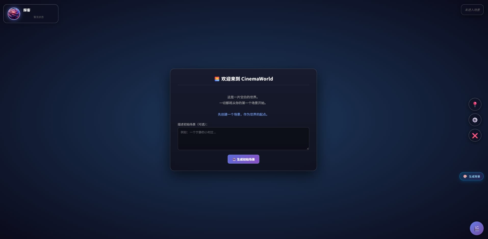

# CinemaWorld 🌏

> 在 AI 创造的世界中游乐。

CinemaWorld 是一个为 SillyTavern 设计的沉浸式视觉小说 / RPG 世界引擎扩展。它把聊天 AI 变成一个真正的"游戏主持人（GM）"，你不再只是和 AI 对话，而是在一个由 AI 动态生成、持续演化的世界里探索、战斗、经营、社交。

---


## 📖 目录

- [这是什么](#这是什么)
- [核心特性](#核心特性)
- [快速开始](#快速开始)
- [目录结构](#目录结构)
- [模块架构](#模块架构)
- [系统详解](#系统详解)
  - [世界与场景](#世界与场景)
  - [剧情与章节](#剧情与章节)
  - [战斗系统](#战斗系统)
  - [模拟经营](#模拟经营)
  - [虚拟社交](#虚拟社交)
  - [羁绊系统](#羁绊系统)
  - [立绘点击反应](#立绘点击反应)
  - [AI 背景图生成](#ai-背景图生成)
- [游戏规则引擎](#游戏规则引擎)
- [资源文件规范](#资源文件规范)
- [存档系统](#存档系统)
- [常见问题](#常见问题)
- [开发指南](#开发指南)
- [致谢](#致谢)

---

## 这是什么

传统的 AI 角色扮演，本质是"你一句，AI 一句"，故事线由聊天记录承载，缺乏结构、状态和世界感。

**CinemaWorld 想解决的是：让 AI 成为一个真正的游戏引擎。**

它在这个扩展里实现了：

- **世界状态**：场景、人物、物品、环境数据都是持久化的结构化数据，不是聊天记录的一部分
- **规则引擎**：游戏规则（属性派生、升级、触发事件、战斗公式）由 AI 生成一次，之后由代码执行
- **多子系统**：战斗、经营、社交、羁绊……每个都是独立运转的模块
- **数据驱动的 AI**：AI 每次生成时，拿到的是"当前世界的完整快照"，而不是模糊的记忆

一句话：**AI 负责创造和叙事，代码负责记住和运算。**

---

## 核心特性

| 模块 | 说明 |
|------|------|
| 📍 **场景系统** | 结构化场景（人物/实体/环境数据/行动），可浏览、编辑、切换 |
| 📖 **剧情系统** | 剧情卡 + 章节 + 卷三级结构，自动压缩归档，支持选项与分支 |
| ⚔️ **战斗系统** | 完整回合制战斗，公式由规则引擎驱动，支持自定义属性与技能 |
| 🏭 **模拟经营** | AI 生成经营玩法（农田/牧场/商店/工厂），实时流逝 + 环境规则 |
| 🎒 **背包装备** | 格子化背包、装备栏、属性加成自动汇总 |
| 🏪 **商店系统** | AI 生成商店，支持多货币、买卖、以物易物 |
| 📱 **虚拟社交** | 单聊/群聊/朋友圈，角色会主动发动态、评论 |
| 💫 **羁绊系统** | 角色 × 角色的独立小剧场，玩家不在场 |
| 👆 **点击反应** | 点击立绘不同部位触发不同表情 + 台词 |
| 🎨 **AI 生图** | 接入 ComfyUI，为场景自动生成背景图 |
| ⚙️ **规则引擎** | 派生属性、升级规则、触发事件、战斗规则，全部可配置 |
| 🧠 **交互摘要** | 自动压缩长期交互历史，让 AI 永远记得关键剧情 |
| 💾 **存档系统** | 版本迁移 + 深度归一化，老存档自动升级 |

---

## 快速开始

### 前置要求

- [SillyTavern](https://github.com/SillyTavern/SillyTavern) `1.11.0+`
- 一个可用的 AI 后端（任意 SillyTavern 支持的模型）

### 安装

1. 下载本项目，解压到 SillyTavern 的扩展目录：

```
SillyTavern/data/<你的用户>/extensions/third-party/CinemaWorld/
```

或者进入 SillyTavern 的 **扩展 → 安装扩展**，填入本仓库的 Git URL。

2. 刷新页面（或重启 SillyTavern）。

3. 页面右下角会出现一个 🎬 悬浮按钮，点击进入。

### 首次启动流程

```
创建初始场景 → 创建你的角色 → 生成游戏规则 → 开始第一段剧情
```

每一步都有 AI 辅助，也可以手动填写 / 跳过。

### 资源文件（可选）

CinemaWorld 会自动查找以下资源，**没有也能跑**（会用占位符代替）：

```
CinemaWorld/
├── images/
│   ├── 背景图片/     ← 场景背景（<场景背景字段>.png）
│   ├── 立绘/         ← 角色立绘
│   │   ├── 男/
│   │   │   ├── 1.png ~ 200.png      （随机池）
│   │   │   └── <角色名>/
│   │   │       ├── 默认.png
│   │   │       ├── 开心.png
│   │   │       └── 生气.png ...
│   │   └── 女/
│   └── 玩家/         ← 玩家立绘
│       ├── player.png
│       ├── 默认.png
│       ├── 开心.png ...
│       └── 头像.png
├── music/            ← 背景音乐（<音乐名>.mp3）
└── workflows/        ← ComfyUI 工作流 JSON
    └── manifest.json
```

**立绘查找顺序**（找到即停）：

```
立绘/<性别>/<角色名>/<状态>.png
立绘/<性别>/<角色名>/默认.png
立绘/<性别>/<角色名>.png
立绘/默认/<角色名>/<状态>.png
立绘/默认/<角色名>.png
立绘/<角色名>.png
```

如果角色没有专属立绘，系统会从 `<性别>/1.png ~ 200.png` 里随机分配一张。

---

## 目录结构

```
CinemaWorld/
├── manifest.json              # 扩展清单
├── index.js                   # 入口：按依赖顺序加载模块
├── style.css                  # 样式入口（@import 拆分文件）
├── style/                     # 拆分后的样式
│   ├── 01-avatar.css
│   ├── 02-ui-core.css
│   ├── ...
│   └── 18-background-gen.css
└── modules/                   # 功能模块
    ├── css-loader.js
    ├── core.js
    ├── world.js
    ├── player.js
    ├── scene.js
    ├── story.js
    ├── rules.js
    ├── interact.js
    ├── battle.js
    ├── simulation.js
    ├── city.js
    ├── industry.js
    ├── background-gen.js
    ├── background-ui.js
    ├── social.js
    ├── bond.js
    ├── click.js
    ├── ui.js
    └── save.js
```

---

## 模块架构

模块严格按依赖顺序加载，**不要随意调整顺序**：

```
L0  css-loader          ← 样式加载
L1  core                ← 全局状态 / 角色档案 / 骰子 / 语义识别
L2  world               ← 世界数据 / 背景 / 音乐 / 立绘
L2  player              ← 玩家状态 / 装备 / 派生属性 / 标签效果
L3  scene               ← 场景浏览 / 编辑 / 行动 / 立绘层 / 头像栏
L3  story               ← 剧情 / 章节 / 交互历史 / 交互摘要
L3  rules               ← 规则引擎 / 触发器 / 游戏钩子
L4  interact            ← 效果系统 / 交互 / 背包 / 商店
L4  battle              ← 战斗系统
L4  simulation          ← 模拟经营
L4  city / industry     ← 城市 / 工业（模拟经营扩展）
L4  background-gen      ← AI 背景图生成（引擎层）
L5  background-ui       ← AI 背景图生成（UI 层）
L5  social              ← 虚拟社交
L5  bond                ← 羁绊系统
L5  click               ← 立绘点击反应
L5  ui                  ← UI / VN / 手机 / 玩家创建 / 启动
L6  save                ← 存档（依赖所有模块）
```

---

## 系统详解

### 世界与场景

场景是 CinemaWorld 的基本单位，包含：

| 字段 | 说明 |
|------|------|
| `name` | 场景名（唯一） |
| `description` | 描述 |
| `environment` | 环境特征文本 |
| `environmentData` | 结构化环境数据（时间/天气/温度……任意键） |
| `background` | 背景图名 |
| `music` | 音乐名 |
| `sceneCharacters` | 场景人物数组 |
| `sceneItems` | 场景实体数组（物品/建筑/植物/机关……） |
| `sceneActions` | 玩家可执行的行动 |
| `raw` | 原始文本（用于重建） |

**环境数据是自由键值对**，你可以定义任何字段（时间、天气、潮汐、月相、声望……），系统会存储、显示，并作为 AI 上下文的一部分。

**场景实体支持专用类型**：

- `[类型:遭遇|...]` → 战斗遭遇，可触发战斗
- `[类型:经营|经营类型:农田|...]` → 模拟经营系统
- `[类型:商店|货币:金币|收购:是|...]` → 商店系统
- 其他任意类型 → 普通可交互实体

---

### 剧情与章节

三级结构：

```
卷（Volume）      ← 5-8 章，自动归档进世界史
 └ 章节（Chapter） ← 8 段剧情，自动压缩成前情提要
    └ 剧情卡（Story）← 单次剧情，含对话/选项/效果/场景更新
```

**自动化机制**：

- 每完成 8 段剧情 → 自动滚动到下一章
- 每完成 8 章 → 自动结束本卷，生成卷摘要
- 每 5 卷 → 归档进世界史
- 章内超过 12 段剧情 → 自动压缩前 4 段

**剧情卡输出格式**（AI 生成）：

```
【剧情】
类型: 主线
标题: ...
场景: ...
🎵 音乐: ...

【摘要】
...

【对话】
【角色名|显示|左|女|开心】: 台词
【旁白】: 环境描写

【场景更新】
新增人物:
- 【名|性别|心情|好感度|状态|主次】：描述，[标签]

【效果】
数值变化: 体力 -10

【选项】
A. 选项内容
B. 选项内容
```

---

### 战斗系统

完整回合制，由规则引擎驱动。

**战斗流程**：

```
遭遇实体 → AI 生成战斗包 → 预览/编辑 → 战前剧情 → 战斗 → 战后剧情 → 奖励结算
```

**战斗包切片**（AI 一次生成，按标签切分）：

| 标签 | 内容 |
|------|------|
| 战前剧情 | VN 对话 |
| 战斗行动 | 玩家的技能池 |
| 战后剧情·胜利 | 胜利对话 |
| 战后剧情·失败 | 失败对话 |
| 战斗奖励 | 数值/物品/状态 |
| 场景更新 | 敌人移除、尸首生成等 |
| 胜利摘要 | 写入上下文的战斗纪要 |
| 音乐提示 | 战前/战中/战后音乐 |

**公式系统**（支持任意属性）：

```
伤害公式: {攻击} * (1 + {灵力}/100) - {敌人.防御}
命中判定: d20 + {敏捷} >= 12
先攻: d20 + {敏捷}
暴击: 伤害 × 1.5
```

支持 `{我方.属性}` / `{敌人.属性}` 命名空间，支持骰子、四则运算、括号、`max()` / `min()`。

**敌人属性可自由定义**——不只是 HP/攻击/防御。你可以给"精神系敌人"定义 `恐惧`、`理智伤害`，给"社交系敌人"定义 `魅力`、`社交值`。

---

### 模拟经营

AI 根据实体信息生成一套完整的经营系统。

**支持的模式**：

- `grow`（生长型）：种下种子 → 经过时间 → 收获产物（农田、养殖）
- `consume`（消耗型）：上架商品 → 随时间卖出 → 获得金钱（商店、贩卖机）

**核心概念**：

| 概念 | 说明 |
|------|------|
| 格子 | 25 个格子的网格，每格有独立的字段（肥力、湿度……） |
| 槽位 | 格子里的东西（作物、牲畜、商品） |
| 行为 | 玩家可执行的操作（浇水、施肥、繁殖、宰杀……） |
| 时间规则 | 字段随时间自动变化（湿度每 8 秒 -1） |
| 完成规则 | 什么条件下算"成熟"，产量倍率多少 |
| 环境规则 | 场景环境数据如何影响经营（雨天湿度 +2/秒，夜间生长 ×10） |
| 内容物 | 可购买/可产出的物品（种子、产物、饲料……） |

**环境规则是亮点**——它把场景的环境数据（时间/天气/温度）和经营系统连起来，让"下雨"、"入夜"这些描述真正产生游戏效果。

---

### 虚拟社交

手机里的社交 App，包含：

- **单聊**：和单个角色私聊，角色会主动发消息
- **群聊**：多人聊天，角色之间会互相接话
- **朋友圈**：角色发动态，玩家可点赞评论，角色会回应

**AI 生成时会注入**：

- 角色的档案（性格、心情、好感度、状态）
- 与玩家的交互历史（摘要）
- 最近大家发过的动态（避免撞话题）
- 世界背景与当前场景

**群聊特色**：不是每个人都会说话，成员之间会互相接话、吐槽，更接近真实群聊。

---

### 羁绊系统

角色 × 角色的独立小剧场，**玩家不在场**。

- 选 2 个以上角色 → AI 生成他们之间的一段日常互动
- 有主题输入框（可选）
- 自动压缩历史，让 AI 记得他们之间的关系
- 支持 VN 模式播放
- 复用交互摘要系统，羁绊剧情会参考角色与玩家的近期互动

---

### 立绘点击反应

点击立绘的不同部位，触发不同的表情和台词。

**工作流程**：

1. AI 根据角色性格、心情、好感度、交互历史，生成立绘热区划分
2. 每个热区有 2-4 条反应（表情 + 台词 + 权重）
3. 测量真实立绘尺寸，让 AI 按实际宽高比划分热区
4. 点击时按权重随机抽取，切换立绘状态 + 显示气泡

**热区示例**：

```
热区：
- 左脸: 0 ~ 20, 0 ~ 50
- 右脸: 0 ~ 20, 50 ~ 100
- 胸口: 20 ~ 60
- 左手: 60 ~ 100, 0 ~ 50
- 右手: 60 ~ 100, 50 ~ 100

反应：
头部:
- 害羞|别、别摸头啦…|3
- 生气|再摸就咬你哦。|1
```

---

### AI 背景图生成

接入 **ComfyUI**，为场景自动生成背景图。

**流程**：

```
场景信息 → AI 生成提示词 → ComfyUI 生成图片 → 存入 IndexedDB → 应用到场景
```

**配置项**：

- ComfyUI 地址（默认 `127.0.0.1:8188`）
- 提示词来源：CinemaWorld / KoboldCPP / 远程 API
- 提示词风格：自然语言 / CLIP 标签
- 画风前缀、负面提示词、宽高
- 工作流选择（支持导入自定义 ComfyUI workflow JSON）

**提示词生成**：

- AI 只描述场景（建筑、光照、氛围、天气），**严格禁止出现人物**
- 支持两种风格：
  - **自然语言**（推荐 Qwen-Image / Anima / Flux / SD3 / MJ）
  - **CLIP 标签**（推荐 SD1.5 / SDXL / Pony）

**存储**：

- 生成的图片存在 IndexedDB，不进存档
- 场景只保存 `generatedBackgroundId`
- 存档加载时自动 GC 孤儿图片

---

## 游戏规则引擎

游戏规则是整个系统的"宪法"，由 AI 生成一次，之后由代码执行。

**规则格式**：

```
【派生规则】
生命值 = 体质 × 5 + 等级 × 10
攻击力 = 力量 × 2 + 敏捷
...

【升级规则】
等级 +1；生命值 +10；力量 +1

【触发规则】
经验满 → 等级+1；力量+1；经验归零
生命值空 → 触发事件 死亡|玩家倒下了
饱食度空 → 生命值-10；获得状态 饥饿

【战斗规则】
伤害公式: {攻击} - {防御}
命中判定: d20 + {敏捷} >= 12
暴击: 伤害 × 1.5
先攻: d20 + {敏捷}
胜利条件: 敌人 HP 归零
失败条件: 玩家 HP 归零
属性映射: 攻击=力量，防御=体质，敏捷=身法，生命=生命值
```

**规则引擎做的事**：

- **派生规则** → 自动计算派生属性（如最大生命值）
- **升级规则** → 经验满时自动应用
- **触发规则** → 数值条满/空/达阈值时自动触发（数值变化 / 物品获得 / 状态附加 / 事件）
- **战斗规则** → 驱动战斗系统的命中/伤害/暴击/先攻
- **状态定义** → 定义状态的效果（属性修正、每回合变化、跳过回合、持续回合）

**触发事件**会走 AI 生成剧情，自动插入当前世界上下文，生成一段 VN 剧情，并可能触发场景更新。

---

## 资源文件规范

### 场景文本格式

```
*【场景名】*
描述：(场景的详细描述)
环境：(环境特征)
环境数据:[时间:清晨7:00|天气:暴雨|温度:12℃|风力:5级]
背景：(背景图名)
🎵 音乐：(音乐名)

场景人物：
- 【名|性别|心情|好感度|状态|主次】：描述，[标签1、标签2]

场景实体：
- 【名|图标】：描述，[类型|状态|功能|交互方式|可堆叠|其他]

场景行动：
- 【行动名|图标|once】：描述
- 【行动名|图标|repeat】：描述
```

### 物品/装备字段

```
【物品名|图标】：描述，[类型:消耗品|功能:回复 50 点生命|可堆叠|买价:10|卖价:5|库存:20]
【装备名|图标】：描述，[类型:武器|攻击:+5|暴击:+10%|图标:⚔️]
```

**属性字段规则**：

- 值必须是 `数字` / `±数字` / `数字%` 之一
- 数值条类字段只写"上限加成"（如 `体力:+50` 表示体力上限 +50）
- 非属性字段（类型/状态/图标/交互方式）不会被当成加成

### 状态效果

```
获得状态 中毒（生命-5|持续3回合）
获得状态 狂暴（攻击+50%|防御-30%）
获得状态 眩晕（跳过回合|持续1回合）
```

---

## 存档系统

**保存方式**：`localStorage`（键名 `CinemaWorld_save`），每 30 秒自动保存，退出时保存。

**版本迁移**：旧存档会自动升级到最新结构。

**深度归一化**：无论存档缺什么字段，都会补齐成标准结构，不会崩溃。

**导出/导入**：

- 导出：设置 → 导出存档，文件名包含章节名 + 进度 + 时间戳
- 导入：会显示存档预览（场景数/角色数/章节数……），确认后覆盖

**IndexedDB**：AI 生成的背景图存在这里，不进存档。存档加载时会自动清理孤儿图片。

**重置世界**：设置 → 重置世界，会清空所有数据并重新开始。

---

## 常见问题

### 立绘不显示？

1. 检查文件路径是否符合规范（见 [资源文件规范](#资源文件规范)）
2. 打开浏览器控制台，看是否有 `[CinemaWorld] 立绘匹配: ...` 的日志
3. 可以用 `SpriteManager.diagnose('男')` 手动诊断随机池

### 背景图/音乐找不到？

- 背景图放在 `images/背景图片/`，音乐放在 `music/`
- 文件名必须和场景里的 `背景:` / `🎵 音乐:` 字段一致
- 支持 `.png/.jpg/.jpeg/.webp` 和 `.mp3/.ogg/.wav/.m4a`

### AI 生成的内容格式不对？

- CinemaWorld 的所有 prompt 都写了严格的输出格式
- 如果 AI 不遵守，可以尝试：
  - 换一个更强的模型
  - 在 SillyTavern 里调低温度
  - 手动编辑生成结果（大部分生成都有"可编辑"文本框）

### 战斗数值不对？

- 战斗公式由**游戏规则**里的 `【战斗规则】` 定义
- 去手机 → 规则 → 查看/编辑，确认公式和属性映射正确
- 战斗界面右上角 ⚙️ 可以查看当前生效的战斗规则

### 存档打不开？

- 打开浏览器控制台，看 `[CinemaWorld] 加载失败:` 的具体错误
- 如果是旧存档，可能是迁移失败。可以尝试导出后手动编辑 JSON
- 存档是纯文本 JSON，可以直接查看结构

### 生成的背景图很丑 / 不符合预期？

- 在手机 → 生图管理 → 提示词风格，试试切换"自然语言 / CLIP 标签"
- 调整画风前缀（比如加 `anime style, masterpiece`）
- 如果用的是 SD1.5，用 CLIP 标签；如果用 Qwen-Image/Flux，用自然语言
- 检查 ComfyUI 的工作流配置是否正确

---

## 开发指南

### 代码组织原则

- **每个模块一个 IIFE**，挂载到 `window`
- **不污染全局命名空间**，所有对象都有明确前缀
- **数据与 UI 分离**：`XxxManager` 管数据，`XxxUIManager` 管界面
- **AI 生成统一走 `generateFunctionalReply`**，不污染对话上下文

### 添加新模块

1. 在 `modules/` 下新建文件
2. 用 IIFE 包裹，挂载需要的对象到 `window`
3. 在 `index.js` 的 `MODULES` 数组里**按依赖顺序**插入

### 调试工具

打开控制台后可用：

```js
CinemaWorld.worldState           // 完整世界状态
PlayerStateManager.player        // 玩家数据
RuleEngine.rules                 // 当前规则
StoryManager.storyList           // 剧情列表
SpriteManager.diagnose('男')     // 立绘诊断
SaveManager.serialize()          // 导出当前状态
```

### 样式规范

- 所有样式拆分到 `style/` 目录，用数字前缀控制加载顺序
- 类名统一用 `cw-` 前缀或 `cinemaworld-` 前缀
- 不要用内联 style（除非是动态计算的值）

---

## 致谢

- 灵感来自各种 AI 角色扮演 + 传统 RPG/视觉小说的结合尝试
- 立绘/背景/音乐资源需要玩家自备，本项目不包含任何版权素材
- 感谢所有测试和反馈的朋友

---

## License

MIT

---

**CinemaWorld** — 让 AI 不只是讲故事，而是创造世界。 🎬
