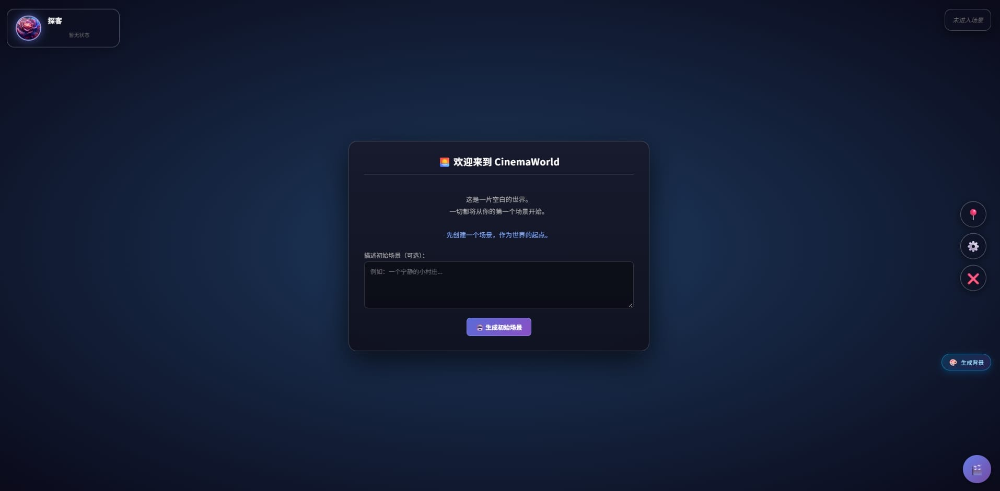
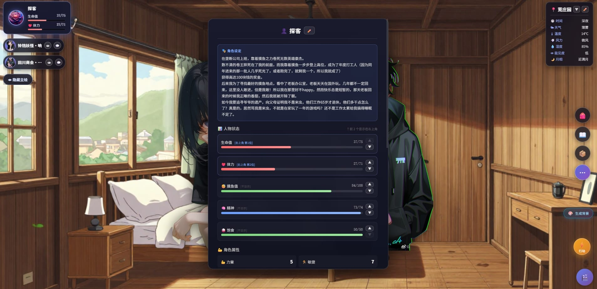
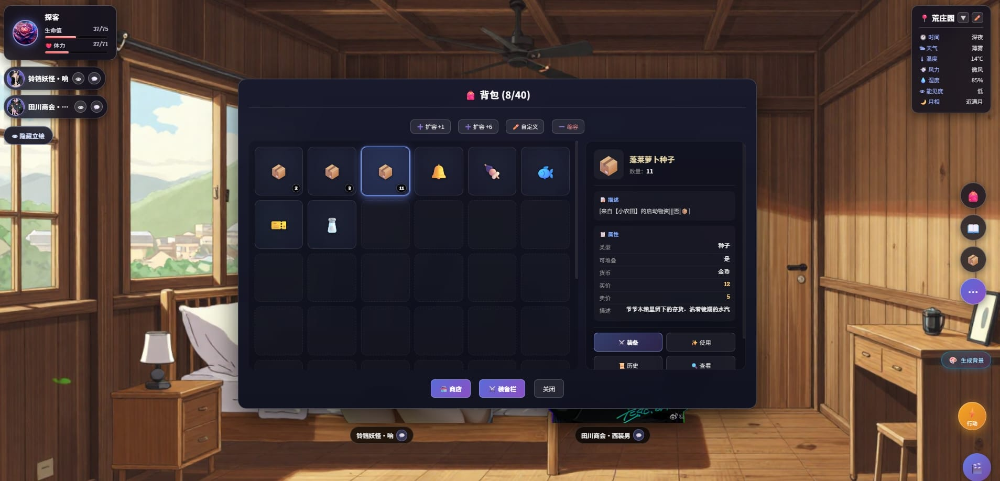
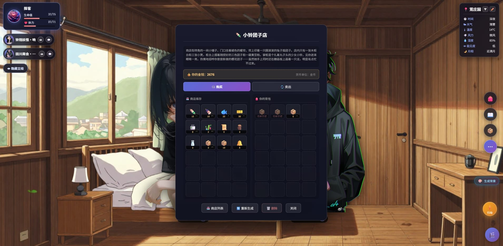
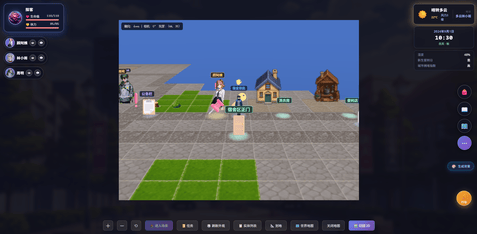
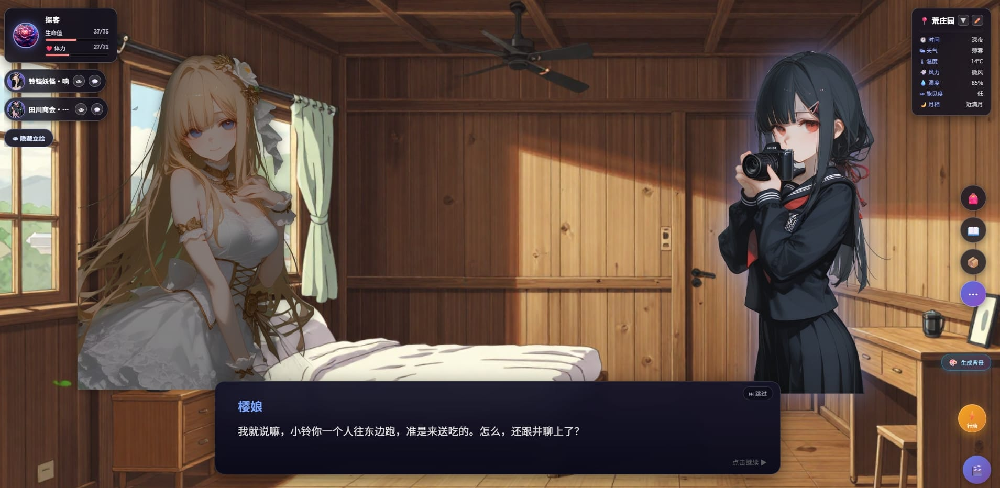
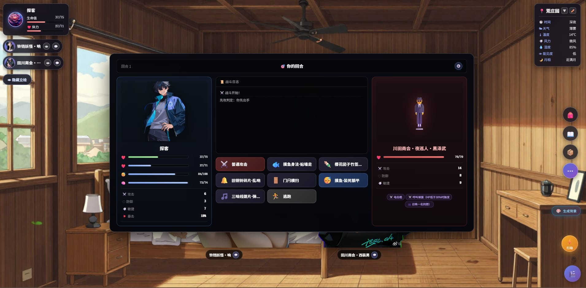
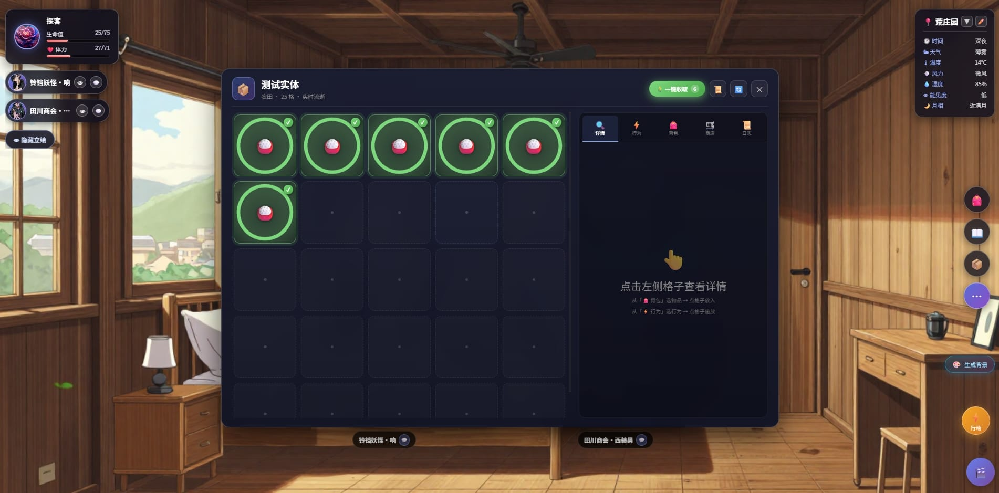
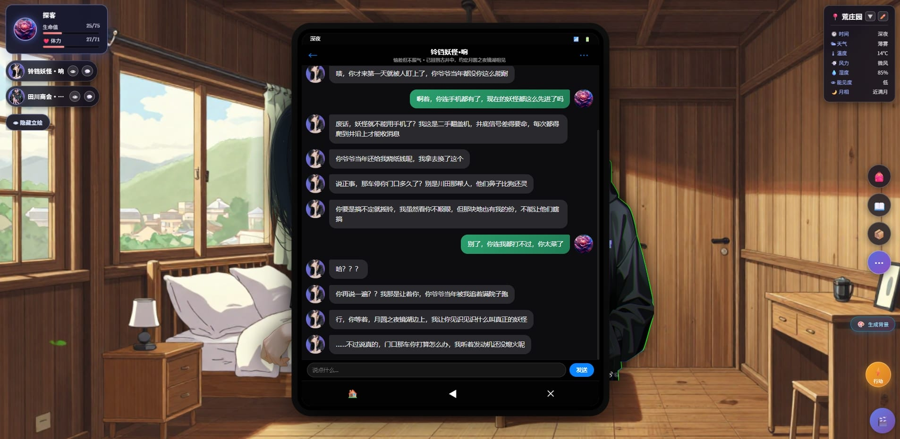
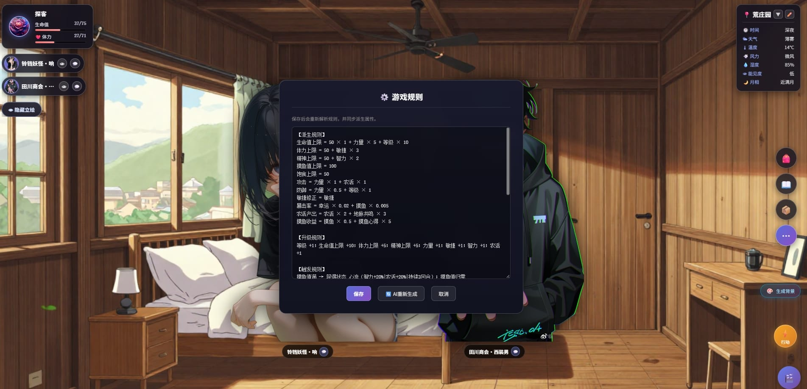

# CinemaWorld 🌏

> 在 AI 创造的世界中游乐。

CinemaWorld 是一个为 SillyTavern 设计的沉浸式视觉小说 / RPG 世界引擎扩展。它把聊天 AI 变成一个真正的"游戏主持人（GM）"，你不再只是和 AI 对话，而是在一个由 AI 动态生成、持续演化的世界里探索、战斗、经营、社交。
使用起来不需要复杂的角色卡，作者本人使用的时候角色卡经常只有不到1000字，用来设定简易的世界观和背景，并且连世界书都没开过。
不仅如此，得益于优秀的提示词设计，它非常节约tokens，平均30分钟的游玩过程总消费10-20万的tokens，换句话说，它使用起来十分便宜（30分钟，0.1元左右的消费），而且支持本地模型使用。

---





---

## 📢 功能更新

> **最近更新：2026年10月3日**

### 🎮 3D 地图视角

地图现在支持 **2D / 3D 双模式切换**。点击地图窗口的「🎮 3D 视角」按钮，即可进入越肩视角的 3D 世界：

- **越肩视角**：相机跟随玩家背后，WASD 相对相机方向移动，Q/E 90° 转向
- **程序化天空**：0 纹理、1 draw call，昼夜时段自动切换（黎明 / 正午 / 黄昏 / 夜晚），夜晚有闪烁星空
- **真实纹理**：地形、装饰、建筑、角色全部复用 2D 图集切片，无需额外素材
- **建筑进入**：点击建筑门口的青绿光圈直接进入
- **性能优化**：分块 InstancedMesh 渲染、视距剔除、立绘自动降采样至 384px



---

### 🗺️ 主线任务系统

AI 生成的主线任务链，贯穿所有地图：

- **自动生成**：地图生成时自动创建开局主线
- **跨地图追踪**：目标在其他地图时只记指针，抵达后自动落地
- **三种落点**：格子 / 实体 / 出入口，全部支持
- **金色标记**：地图上以金色 ❗ 标记，靠近即触发剧情

---

### 📜 地图任务系统

每张地图独立生成的任务链：

- **四种类型**：探索 / 收集 / 击杀 / 交互
- **智能落点**：收集任务自动生成对应物品，击杀任务自动生成敌人
- **进度追踪**：拾取 / 击杀 / 到达 / 交互自动推进
- **奖励系统**：物品奖励（完整字段）+ 数值奖励（自动匹配玩家属性）
- **接取剧情**：每个任务都有接取 / 完成的 VN 剧情

---

### 📐 玩法区（划地经营）

在地图上自由划定经营区：

- **三点定框**：点击三次确定矩形范围
- **AI 生成配置**：环境属性 / 动作 / 作物 / 商店，全部由 AI 生成
- **模板系统**：可保存为模板，跨存档复用
- **环境联动**：天气、季节、时间真实影响经营（下雨自动补水、冬天生长变慢）
- **补给商店**：卖水、卖肥料、卖加速道具，支持库存与补货

---

### 🚶 NPC 主动搭讪

NPC 不再只是站着等玩家：

- **漫步**：每小时随机移动，地图充满生机
- **主动靠近**：玩家进入注意范围后，NPC 会主动走过来搭话
- **独立提示词**：搭讪是"NPC 主动开口"，不是"玩家去找 NPC"
- **可能赠礼**：好感度高的 NPC 可能主动送东西

---

### ⚔️ 遭遇追击

敌对实体不再原地等待：

- **索敌范围**：玩家进入 8 格内开始追击
- **节流移动**：每 3 游戏分钟走一步，不会瞬移
- **放弃机制**：玩家跑远 15 格后放弃
- **战斗冷却**：战斗结束后 60 分钟冷却，不会立刻又追上来

---

### 🕐 时间规则引擎

AI 生成的完整时间系统：

- **历法**：小时 / 日 / 月 / 年 / 季节，全部可配置
- **时段**：清晨 / 上午 / 正午 / 下午 / 黄昏 / 夜晚
- **节日**：自定义节日，触发特殊事件
- **天气池**：按季节定义天气概率
- **懒更新**：玩家不在的地图用 `worldMinutes` 补算，零开销

---

🔊 CinemaWorld TTS 语音系统

为对白自动配音，支持**音色自动分配**、**同名专属音色**、**背景音乐自动闪避**。

- 后端：[audio.cpp](https://github.com/...)（本地推理）
- 模型：OmniVoice-GGUF / Kokoro-82M-GGUF
- 前端：CinemaWorld 内置

---

## 📖 路径变量

| 变量 | 含义 |
|---|---|
| `<AUDIOCPP_DIR>` | audio.cpp 解压目录（如 `D:\ai\audio.cpp\`） |
| `<ST_DIR>` | SillyTavern 安装目录 |
| `<CW_TTS_VOICES>` | `<ST_DIR>\data\default-user\extensions\third-party\CinemaWorld\modules\TTS\voices` |

> ⚠️ 文中具体路径**只是示例**，请替换成你自己的实际路径。

---

## 🚀 安装步骤

### 1. 下载 audio.cpp

下载预编译包（如 `audio-v0.9.0-bin-windows-x64-cuda12.4.zip`），
解压到任意目录（记为 `<AUDIOCPP_DIR>`）。

### 2. 创建 `server.json`

在 `<AUDIOCPP_DIR>` 下建 `server.json`：

```json
{
  "host": "127.0.0.1",
  "port": 8080,
  "backend": "cuda",
  "models": [
    {
      "id": "omnivoice",
      "family": "omnivoice",
      "path": "./models/OmniVoice-GGUF",
      "task": "tts",
      "mode": "offline"
    }
  ]
}
```

> 💡 `id` 必须和前端"TTS 模型"一致；`path` 相对 `<AUDIOCPP_DIR>`。

### 3. 下载模型

放 `<AUDIOCPP_DIR>\models\OmniVoice-GGUF\`，里面有 `.gguf` 文件：

```
<AUDIOCPP_DIR>\models\OmniVoice-GGUF\
├── omnivoice-f16.gguf
└── ...
```

### 4. 建立音色库（★ 两个位置）

**`.wav` 和 `.txt` 分开放，结构必须完全一致。**

**① `.wav` 放后端** `audio.cpp\voices\`：

```
voices\
├── narrator\default.wav
├── player\default.wav
├── other\default.wav
├── female\
│   ├── default.wav          ← 必须有（兜底）
│   ├── 1.wav ... 20.wav     ← 抽签池
│   └── 林青禾.wav           ← 可选（同名专属）
└── male\
    ├── default.wav
    └── 1.wav ... 20.wav
```

**② `.txt` 放前端** `CinemaWorld\modules\TTS\voices\`（结构完全一样）：

```
voices\
├── narrator\default.txt
├── player\default.txt
├── other\default.txt
├── female\
│   ├── default.txt
│   ├── 1.txt ... 20.txt
│   └── 林青禾.txt
└── male\
    ├── default.txt
    └── 1.txt ... 20.txt
```

**规则**：

| 文件 | 说明 |
|---|---|
| `.wav` + `.txt` **同名配对** | 一个 wav 必须配一个同名 txt |
| `default.wav` | 每个文件夹必须有 |
| `1.wav` ~ `N.wav` | 抽签池，放几个配几个 |
| `角色名.wav` | 可选，同名角色优先 |
| `.wav` 时长 | **3-10 秒**，太长变慢变差 |
| `.txt` 内容 | 音频读的文字，**逐字对应** |

### 5. 启动服务

在 `<AUDIOCPP_DIR>` 下打开 CMD/PowerShell，运行：

```powershell
.\audiocpp_server.exe --ui --ui-management --backend cuda --device 0 --config server.json --cors-origins "*"
```

> - `--device 0` 单卡；多卡用 `1`
> - `--backend cuda` 无 N 卡改 `cpu`
> - `--cors-origins "*"` **不能漏**，否则前端请求被拦

**验证**：浏览器打开 `http://127.0.0.1:8080` 能看到 UI。

### 6. 配置 CinemaWorld

打开 SillyTavern → 手机 → **🔊 语音**：

| 项目 | 填什么 |
|---|---|
| 启用语音 | ✅ |
| 后端地址 | `http://127.0.0.1:8080` |
| TTS 模型 | `omnivoice` |
| 参考音频目录 | `voices` |
| 音色池大小 | 实际放了几个 `1-N.wav` 就填几 |
| 背景音量 | 50% |
| 打完字等语音播完 | ❌（推荐） |

点 **🎤 测试合成** 验证。

---

## 🎭 音色匹配规则

```
旁白 / 玩家 / 其他 → 各自 default.wav

男 / 女角色
  ├─ 1. 同名专属：voices/female/林青禾.wav 存在？ → 用它
  ├─ 2. 抽签：从 1~N.wav 随机抽一个（同局内稳定）
  └─ 3. 兜底：female/default.wav → narrator/default.wav
```

- **同一局游戏** = 从新游戏到世界重置之间
- **世界重置**后同一角色重新抽签
- **抽签范围** = 前端"音色池大小"

---

## ✨ 专属音色

给"林青禾"做专属音色：

| 文件 | 位置 |
|---|---|
| `林青禾.wav` | `<AUDIOCPP_DIR>\voices\female\林青禾.wav` |
| `林青禾.txt` | `<CW_TTS_VOICES>\female\林青禾.txt` |

放好后点 **🔄 重置角色降级标记** 生效。

---

## 📖 目录

- [这是什么](#这是什么)
- [核心特性](#核心特性)
- [快速开始](#快速开始)
- [目录结构](#目录结构)
- [模块架构](#模块架构)
- [系统详解](#系统详解)
  - [世界与场景](#世界与场景)
  - [剧情与章节](#剧情与章节)
  - [战斗系统](#战斗系统)
  - [模拟经营](#模拟经营)
  - [虚拟社交](#虚拟社交)
  - [羁绊系统](#羁绊系统)
  - [立绘点击反应](#立绘点击反应)
  - [AI 背景图生成](#ai-背景图生成)
- [游戏规则引擎](#游戏规则引擎)
- [资源文件规范](#资源文件规范)
- [存档系统](#存档系统)
- [常见问题](#常见问题)
- [开发指南](#开发指南)
- [致谢](#致谢)

---

## 这是什么

传统的 AI 角色扮演，本质是"你一句，AI 一句"，故事线由聊天记录承载，缺乏结构、状态和世界感。

**CinemaWorld 想解决的是：让 AI 成为一个真正的游戏引擎。**

它在这个扩展里实现了：

- **世界状态**：场景、人物、物品、环境数据都是持久化的结构化数据，不是聊天记录的一部分
- **规则引擎**：游戏规则（属性派生、升级、触发事件、战斗公式）由 AI 生成一次，之后由代码执行
- **多子系统**：战斗、经营、社交、羁绊……每个都是独立运转的模块
- **数据驱动的 AI**：AI 每次生成时，拿到的是"当前世界的完整快照"，而不是模糊的记忆

一句话：**AI 负责创造和叙事，代码负责记住和运算。**

---

## 核心特性

| 模块 | 说明 |
|------|------|
| 📍 **场景系统** | 结构化场景（人物/实体/环境数据/行动），可浏览、编辑、切换 |
| 📖 **剧情系统** | 剧情卡 + 章节 + 卷三级结构，自动压缩归档，支持选项与分支 |
| ⚔️ **战斗系统** | 完整回合制战斗，公式由规则引擎驱动，支持自定义属性与技能 |
| 🏭 **模拟经营** | AI 生成经营玩法（农田/牧场/商店/工厂），实时流逝 + 环境规则 |
| 🎒 **背包装备** | 格子化背包、装备栏、属性加成自动汇总 |
| 🏪 **商店系统** | AI 生成商店，支持多货币、买卖、以物易物 |
| 📱 **虚拟社交** | 单聊/群聊/朋友圈，角色会主动发动态、评论 |
| 💫 **羁绊系统** | 角色 × 角色的独立小剧场，玩家不在场 |
| 👆 **点击反应** | 点击立绘不同部位触发不同表情 + 台词 |
| 🎨 **AI 生图** | 接入 ComfyUI，为场景自动生成背景图 |
| ⚙️ **规则引擎** | 派生属性、升级规则、触发事件、战斗规则，全部可配置 |
| 🧠 **交互摘要** | 自动压缩长期交互历史，让 AI 永远记得关键剧情 |
| 💾 **存档系统** | 版本迁移 + 深度归一化，老存档自动升级 |
| 🗺️ **地图系统** | 结构化网格地图，支持 2D / 3D 双视角，AI 生成区域与实体 |
| 📜 **主线任务** | 跨地图主线任务链，自动落地与追踪 |
| 📋 **地图任务** | 每张地图独立的任务链，探索/收集/击杀/交互四种类型 |
| 📐 **玩法区** | 自由划定经营区，AI 生成配置，环境联动 |
| 🎮 **3D 视角** | 越肩视角 3D 渲染，程序化天空，昼夜时段切换 |
| 🚶 **NPC 行为** | 漫步 + 主动搭讪，NPC 不再只是站着 |
| ⚔️ **遭遇追击** | 敌对实体主动追击玩家，跑远才放弃 |
| 🕐 **时间规则** | AI 生成的历法/时段/节日/天气系统，懒更新 |

---

## 快速开始

### 前置要求

- [SillyTavern](https://github.com/SillyTavern/SillyTavern) `1.11.0+`
- 一个可用的 AI 后端（任意 SillyTavern 支持的模型）

### 安装

1. 下载本项目，解压到 SillyTavern 的扩展目录：

```
SillyTavern/data/<你的用户>/extensions/third-party/CinemaWorld/
```

或者进入 SillyTavern 的 **扩展 → 安装扩展**，填入本仓库的 Git URL。

2. 刷新页面（或重启 SillyTavern）。

3. 页面右下角会出现一个 🎬 悬浮按钮，点击进入。

### 首次启动流程

```
创建初始场景 → 创建你的角色 → 生成游戏规则 → 开始第一段剧情
```

每一步都有 AI 辅助，也可以手动填写 / 跳过。

### 资源文件（可选）

CinemaWorld 会自动查找以下资源，**没有也能跑**（会用占位符代替）：

```
CinemaWorld/
├── images/
│   ├── 背景图片/     ← 场景背景（<场景背景字段>.png）
│   ├── 立绘/         ← 角色立绘
│   │   ├── 男/
│   │   │   ├── 1.png ~ 200.png      （随机池）
│   │   │   └── <角色名>/
│   │   │       ├── 默认.png
│   │   │       ├── 开心.png
│   │   │       └── 生气.png ...
│   │   └── 女/
│   └── 玩家/         ← 玩家立绘
│       ├── player.png
│       ├── 默认.png
│       ├── 开心.png ...
│       └── 头像.png
├── music/            ← 背景音乐（<音乐名>.mp3）
└── workflows/        ← ComfyUI 工作流 JSON
    └── manifest.json
```

**立绘查找顺序**（找到即停）：

```
立绘/<性别>/<角色名>/<状态>.png
立绘/<性别>/<角色名>/默认.png
立绘/<性别>/<角色名>.png
立绘/默认/<角色名>/<状态>.png
立绘/默认/<角色名>.png
立绘/<角色名>.png
```

如果角色没有专属立绘，系统会从 `<性别>/1.png ~ 200.png` 里随机分配一张。

---

## 目录结构

```
CinemaWorld/
├── manifest.json              # 扩展清单
├── index.js                   # 入口：按依赖顺序加载模块
├── style.css                  # 样式入口（@import 拆分文件）
├── style/                     # 拆分后的样式
│   ├── 01-avatar.css
│   ├── 02-ui-core.css
│   ├── ...
│   └── 18-background-gen.css
├── images/                    # 图片资源
│   └── 地图/                  # 地图相关图集
│       ├── 地形.png           # 8×8 地形图集
│       ├── 装饰.png           # 8×8 装饰图集
│       ├── 建筑_2x2.png       # 建筑图集
│       ├── 建筑_3x3.png
│       ├── 建筑_4x4.png
│       ├── 角色精灵1.png       # 8×8 兜底角色图集
│       ├── 男1.PNG            # 4×4 男性角色图集
│       ├── 女1.PNG            # 4×4 女性角色图集
│       └── 玩家.png           # 2×2 玩家图集
├── libs/                      # 第三方库
│   └── three.min.js           # Three.js（可选，本地加载失败时走 CDN）
├── TTS/                       # TTS 子模块
│   ├── index.js
│   ├── tts-core.js
│   ├── tts-router.js
│   ├── tts-player.js
│   └── tts-ui.js
└── modules/                   # 功能模块
    ├── css-loader.js
    ├── core.js
    ├── world.js
    ├── player.js
    ├── scene.js
    ├── story.js
    ├── rules.js
    ├── interact.js
    ├── battle.js
    ├── simulation.js
    ├── city.js
    ├── industry.js
    ├── background-gen.js
    ├── background-ui.js
    ├── social.js
    ├── bond.js
    ├── click.js
    ├── ui.js
    ├── save.js
    ├── time-rule.js           # 时间规则引擎
    ├── map/                   # 地图子模块
    │   ├── index.js
    │   ├── map-parser.js
    │   ├── map-schema.js
    │   ├── map-tiles.js
    │   ├── map-gen.js
    │   ├── map-entities.js
    │   ├── map-buildings.js
    │   ├── map-sprites.js
    │   ├── map-interact.js
    │   ├── map-portrait.js
    │   ├── map-manager.js
    │   ├── map-pickup.js
    │   ├── map-decor.js
    │   ├── map-environment.js
    │   ├── map-npc-wander.js
    │   ├── map-encounter-chase.js
    │   ├── map-plot.js
    │   ├── map-farm.js
    │   ├── map-farm-gen.js
    │   ├── map-quest.js
    │   ├── main-quest.js
    │   ├── map-canvas.js
    │   └── 3d/                # 3D 子模块
    │       ├── index.js
    │       ├── three-loader.js
    │       ├── map-3d-textures.js
    │       ├── map-3d-assets.js
    │       ├── map-3d-camera.js
    │       ├── map-3d-canvas.js
    │       ├── map-3d-sky.js
    │       ├── map-3d-interact.js
    │       └── map-3d-ui.js
    └── ...
```

---

## 模块架构

模块严格按依赖顺序加载，**不要随意调整顺序**：

```
L0  css-loader          ← 样式加载
L1  core                ← 全局状态 / 角色档案 / 骰子 / 语义识别
L2  world               ← 世界数据 / 背景 / 音乐 / 立绘
L2  player              ← 玩家状态 / 装备 / 派生属性 / 标签效果
L3  scene               ← 场景浏览 / 编辑 / 行动 / 立绘层 / 头像栏
L3  story               ← 剧情 / 章节 / 交互历史 / 交互摘要
L3  rules               ← 规则引擎 / 触发器 / 游戏钩子
L3  time-rule           ← 时间规则引擎
L4  interact            ← 效果系统 / 交互 / 背包 / 商店
L4  battle              ← 战斗系统
L4  simulation          ← 模拟经营
L4  city / industry     ← 城市 / 工业（模拟经营扩展）
L4  background-gen      ← AI 背景图生成（引擎层）
L5  background-ui       ← AI 背景图生成（UI 层）
L5  social              ← 虚拟社交
L5  bond                ← 羁绊系统
L5  click               ← 立绘点击反应
L5  ui                  ← UI / VN / 手机 / 玩家创建 / 启动
L6  save                ← 存档（依赖所有模块）

map 子模块（由 map/index.js 聚合加载）：
L1  map-parser          ← 文本 → 结构化
L1  map-schema          ← 数据结构 / 校验 / 归一化
L1  map-tiles           ← 2D 图集（地形 / 装饰）
L1  map-gen             ← AI 生成地图规则
L2  map-entities        ← 实体面板 / 详情 / 编辑器
L2  map-buildings       ← 建筑精灵
L2  map-sprites         ← 角色精灵图集
L2  map-interact        ← 实体交互 / 对话 / 出入口
L2  map-portrait        ← 左下角立绘层
L2  map-manager         ← 世界地图列表
L2  map-pickup          ← 拾取系统
L2  map-decor           ← 装饰 / 建筑表 / 关键词匹配
L2  map-environment     ← 环境时钟 / 昼夜滤镜 / HUD
L2  map-npc-wander      ← NPC 漫步 + 主动搭讪
L2  map-encounter-chase ← 遭遇实体主动追击
L2  map-plot            ← 玩法区（划地）
L2  map-farm            ← 种植引擎 + 商店
L2  map-farm-gen        ← 农田规则 AI 生成器
L2  map-quest           ← 地图任务系统
L2  main-quest          ← 主线任务系统
L3  map-canvas          ← 网格 / 摆放 / Canvas 渲染 / 玩家移动
L4  map/3d/*            ← 3D 渲染（three-loader → textures → assets → camera → canvas → sky → interact → ui）
```

---

## 系统详解

### 世界与场景

场景是 CinemaWorld 的基本单位，包含：

| 字段 | 说明 |
|------|------|
| `name` | 场景名（唯一） |
| `description` | 描述 |
| `environment` | 环境特征文本 |
| `environmentData` | 结构化环境数据（时间/天气/温度……任意键） |
| `background` | 背景图名 |
| `music` | 音乐名 |
| `sceneCharacters` | 场景人物数组 |
| `sceneItems` | 场景实体数组（物品/建筑/植物/机关……） |
| `sceneActions` | 玩家可执行的行动 |
| `raw` | 原始文本（用于重建） |

**环境数据是自由键值对**，你可以定义任何字段（时间、天气、潮汐、月相、声望……），系统会存储、显示，并作为 AI 上下文的一部分。

**场景实体支持专用类型**：

- `[类型:遭遇|...]` → 战斗遭遇，可触发战斗
- `[类型:经营|经营类型:农田|...]` → 模拟经营系统
- `[类型:商店|货币:金币|收购:是|...]` → 商店系统
- 其他任意类型 → 普通可交互实体

---

### 剧情与章节

三级结构：

```
卷（Volume）      ← 5-8 章，自动归档进世界史
 └ 章节（Chapter） ← 8 段剧情，自动压缩成前情提要
    └ 剧情卡（Story）← 单次剧情，含对话/选项/效果/场景更新
```

**自动化机制**：

- 每完成 8 段剧情 → 自动滚动到下一章
- 每完成 8 章 → 自动结束本卷，生成卷摘要
- 每 5 卷 → 归档进世界史
- 章内超过 12 段剧情 → 自动压缩前 4 段

**剧情卡输出格式**（AI 生成）：

```
【剧情】
类型: 主线
标题: ...
场景: ...
🎵 音乐: ...

【摘要】
...

【对话】
【角色名|显示|左|女|开心】: 台词
【旁白】: 环境描写

【场景更新】
新增人物:
- 【名|性别|心情|好感度|状态|主次】：描述，[标签]

【效果】
数值变化: 体力 -10

【选项】
A. 选项内容
B. 选项内容
```

---

### 战斗系统

完整回合制，由规则引擎驱动。

**战斗流程**：

```
遭遇实体 → AI 生成战斗包 → 预览/编辑 → 战前剧情 → 战斗 → 战后剧情 → 奖励结算
```

**战斗包切片**（AI 一次生成，按标签切分）：

| 标签 | 内容 |
|------|------|
| 战前剧情 | VN 对话 |
| 战斗行动 | 玩家的技能池 |
| 战后剧情·胜利 | 胜利对话 |
| 战后剧情·失败 | 失败对话 |
| 战斗奖励 | 数值/物品/状态 |
| 场景更新 | 敌人移除、尸首生成等 |
| 胜利摘要 | 写入上下文的战斗纪要 |
| 音乐提示 | 战前/战中/战后音乐 |

**公式系统**（支持任意属性）：

```
伤害公式: {攻击} * (1 + {灵力}/100) - {敌人.防御}
命中判定: d20 + {敏捷} >= 12
先攻: d20 + {敏捷}
暴击: 伤害 × 1.5
```

支持 `{我方.属性}` / `{敌人.属性}` 命名空间，支持骰子、四则运算、括号、`max()` / `min()`。

**敌人属性可自由定义**——不只是 HP/攻击/防御。你可以给"精神系敌人"定义 `恐惧`、`理智伤害`，给"社交系敌人"定义 `魅力`、`社交值`。

---

### 模拟经营

AI 根据实体信息生成一套完整的经营系统。

**支持的模式**：

- `grow`（生长型）：种下种子 → 经过时间 → 收获产物（农田、养殖）
- `consume`（消耗型）：上架商品 → 随时间卖出 → 获得金钱（商店、贩卖机）

**核心概念**：

| 概念 | 说明 |
|------|------|
| 格子 | 25 个格子的网格，每格有独立的字段（肥力、湿度……） |
| 槽位 | 格子里的东西（作物、牲畜、商品） |
| 行为 | 玩家可执行的操作（浇水、施肥、繁殖、宰杀……） |
| 时间规则 | 字段随时间自动变化（湿度每 8 秒 -1） |
| 完成规则 | 什么条件下算"成熟"，产量倍率多少 |
| 环境规则 | 场景环境数据如何影响经营（雨天湿度 +2/秒，夜间生长 ×10） |
| 内容物 | 可购买/可产出的物品（种子、产物、饲料……） |

**环境规则是亮点**——它把场景的环境数据（时间/天气/温度）和经营系统连起来，让"下雨"、"入夜"这些描述真正产生游戏效果。

---

### 虚拟社交

手机里的社交 App，包含：

- **单聊**：和单个角色私聊，角色会主动发消息
- **群聊**：多人聊天，角色之间会互相接话
- **朋友圈**：角色发动态，玩家可点赞评论，角色会回应

**AI 生成时会注入**：

- 角色的档案（性格、心情、好感度、状态）
- 与玩家的交互历史（摘要）
- 最近大家发过的动态（避免撞话题）
- 世界背景与当前场景

**群聊特色**：不是每个人都会说话，成员之间会互相接话、吐槽，更接近真实群聊。

---

### 羁绊系统

角色 × 角色的独立小剧场，**玩家不在场**。

- 选 2 个以上角色 → AI 生成他们之间的一段日常互动
- 有主题输入框（可选）
- 自动压缩历史，让 AI 记得他们之间的关系
- 支持 VN 模式播放
- 复用交互摘要系统，羁绊剧情会参考角色与玩家的近期互动
---

### 立绘点击反应

点击立绘的不同部位，触发不同的表情和台词。

**工作流程**：

1. AI 根据角色性格、心情、好感度、交互历史，生成立绘热区划分
2. 每个热区有 2-4 条反应（表情 + 台词 + 权重）
3. 测量真实立绘尺寸，让 AI 按实际宽高比划分热区
4. 点击时按权重随机抽取，切换立绘状态 + 显示气泡

**热区示例**：

```
热区：
- 左脸: 0 ~ 20, 0 ~ 50
- 右脸: 0 ~ 20, 50 ~ 100
- 胸口: 20 ~ 60
- 左手: 60 ~ 100, 0 ~ 50
- 右手: 60 ~ 100, 50 ~ 100

反应：
头部:
- 害羞|别、别摸头啦…|3
- 生气|再摸就咬你哦。|1
```

---

### AI 背景图生成

接入 **ComfyUI**，为场景自动生成背景图。

**流程**：

```
场景信息 → AI 生成提示词 → ComfyUI 生成图片 → 存入 IndexedDB → 应用到场景
```

**配置项**：

- ComfyUI 地址（默认 `127.0.0.1:8188`）
- 提示词来源：CinemaWorld / KoboldCPP / 远程 API
- 提示词风格：自然语言 / CLIP 标签
- 画风前缀、负面提示词、宽高
- 工作流选择（支持导入自定义 ComfyUI workflow JSON）

**提示词生成**：

- AI 只描述场景（建筑、光照、氛围、天气），**严格禁止出现人物**
- 支持两种风格：
  - **自然语言**（推荐 Qwen-Image / Anima / Flux / SD3 / MJ）
  - **CLIP 标签**（推荐 SD1.5 / SDXL / Pony）

**存储**：

- 生成的图片存在 IndexedDB，不进存档
- 场景只保存 `generatedBackgroundId`
- 存档加载时自动 GC 孤儿图片

---

### 地图系统

CinemaWorld 的地图是**结构化的网格世界**，不是一张图片。

**核心概念**：

| 概念 | 说明 |
|------|------|
| 区域（Region） | 地图上的一块地（村庄、森林、集市……） |
| 连接（Connection） | 区域之间的道路 |
| 实体（Entity） | NPC / 物品 / 建筑 / 标记 / 遭遇 / 出入口 |
| 环境数据 | 每张地图独立的时间/天气/温度…… |
| 玩法区（Plot） | 划定的经营单元（农田、商店……） |

**AI 只生成地图规则，程序生成实际网格**：

```
玩家描述 → AI 输出规则文本 → 解析 → 归一化 → 校验 → 程序铺网格
```

**地图支持 2D / 3D 双视角**：

- **2D**：Canvas 渲染，方向键 / WASD 移动，点击寻路，滚轮缩放
- **3D**：Three.js 越肩视角，WASD 相对相机移动，Q/E 转向，拖拽旋转

**出入口（Portal）**：

- 通向其他地图 / 当前地图的其他区域
- 自动注入反向 portal（保证能回来）
- 建筑门也是 portal（目标就是建筑名）

**主线点**：

- 三种落点：格子 / 实体 / 出入口
- 金色 ❗ 标记，靠近触发剧情
- 跨地图自动落地
- 
---

### 主线任务

AI 生成的跨地图主线任务链。

**生命周期**：

```
地图生成 → onMapBuilt → 无主线则生成初始主线
         → 有主线但未落地 → 生成落地
         → 已落地 → 跳过

玩家触发 → 弹确认框 → 标记 triggered → 生成主线剧情 → 主线推进
```

**三种落点**：

| 落点 | 说明 |
|------|------|
| `cell` | 格子落点（区域内的具体坐标） |
| `entity` | 实体落点（自动创建 marker） |
| `portal` | 出入口落点（自动创建 portal） |

**AI 输出格式**：

```
【主线推进】
目标: (一句话任务名)
提示: (一句话提示玩家去哪儿)
落点: 格子 或 实体 或 出入口
地图: 地图名
区域: (区域 id)
位置: (落点=格子时填锚点名)
实体名: (落点=实体时填)
...
```
---

### 地图任务

每张地图独立生成的任务链。

**四种类型**：

| 类型 | 进度写法 | 说明 |
|------|----------|------|
| `explore` | 探索 | 到达指定区域 |
| `collect` | 收集:物品名×N | 收集 N 个物品 |
| `kill` | 击杀:敌名×N | 击败 N 个敌人 |
| `interact` | 交互:实体名 | 与指定实体交互 |

**自动落点**：

- **收集型**：自动在地图上生成对应物品（可拾取）
- **击杀型**：自动生成对应敌人（集群）
- **交互型**：优先挂到现有同名实体，找不到才生成 marker
- **探索型**：不额外落点，走任务点本身

**奖励系统**：

- **物品奖励**：完整字段（类型/状态/功能/属性/买价/卖价）
- **数值奖励**：自动匹配玩家属性（经验 / 金钱 / 体力 / 自定义属性）

**进度追踪**：

- 拾取 / 击杀 / 到达 / 交互 → 自动推进
- 全部完成 → 播完成剧情 → 发奖励 → 写摘要
- 
---

### 玩法区（划地经营）

在地图上自由划定经营区。

**划地流程**：

```
点击第一格（起点） → 点击第二格（定长） → 点击第三格（定宽） → 点击第四格（确认）
```

**创建方式**：

- **AI 生成**：创建后立刻让 AI 生成配置
- **使用模板**：从模板库复制配置

**配置内容**：

| 内容 | 说明 |
|------|------|
| 环境属性 | 土壤湿度 / 肥力 / 温度…… |
| 区域动作 | 浇水 / 施肥 / 松土…… |
| 可种作物 | 小麦 / 玉米 / 水稻…… |
| 产物表 | 作物的产出物 |
| 环境规则 | 天气 / 季节如何影响经营 |
| 补给商店 | 卖水 / 卖肥料 / 卖加速道具 |

**环境联动**：

- 雨天自动补水
- 冬天生长变慢
- 晴天水分蒸发快

**模板系统**：

- 从已有地块"另存为模板"
- 跨存档复用（存在 localStorage）

---

### 3D 视角

点击地图窗口的「🎮 3D 视角」按钮，进入越肩视角的 3D 世界。

**操作**：

| 操作 | 键位 |
|------|------|
| 移动 | WASD / 方向键（相对相机方向） |
| 转向 | Q / E（90° 吸附） |
| 旋转视角 | 鼠标拖拽 / 触摸拖拽 |
| 缩放 | 滚轮 / 双指捏合 |
| 进入建筑 | 点击门口的青绿光圈 |
| 交互实体 | 点击实体 |

**程序化天空**：

- 0 纹理、1 draw call
- 昼夜时段自动切换（黎明 / 正午 / 黄昏 / 夜晚）
- 夜晚有闪烁星空（3 层 + 1 层亮星）
- 太阳方向随小时变化

**性能优化**：

- 分块 InstancedMesh 渲染（每块 32×32 格）
- 视距剔除（超过 32 格不渲染）
- 装饰远距离简化（超过 24 格不画光圈/描边）
- 立绘自动降采样至 384px
- 像素比上限 2M（超过则降低 RENDER_SCALE）

**纹理来源**：

- 全部复用 2D 图集切片
- 地形 / 装饰 / 建筑 / 角色 / 玩家
- 建筑用 `cropTileTexture` 切成独立纹理（Sprite 不读 offset/repeat）

---

### NPC 行为

NPC 不再只是站着等玩家。

**漫步（Wander）**：

- 每小时随机移动，无声背景活动
- 8 邻域偏移，不跨区域
- 避开道路 / 装饰 / 其他实体
- 有 `不移动` / `固定` 标签的 NPC 不参与

**主动搭讪（Approach）**：

- 玩家进入 5 格范围 → NPC 注意到玩家
- NPC 主动走过来（每 5 游戏分钟走一步）
- 走到玩家 2 格内 → 弹气泡「想和你聊聊」
- 玩家接受 → 触发搭讪 VN
- 玩家拒绝 / 超时 → 进入冷却（180 分钟）
- 玩家跑远 7 格 → 放弃

**搭讪特色**：

- **独立提示词**：明确告诉 AI 这是"NPC 主动开口"
- **可能赠礼**：好感度高的 NPC 可能主动送东西
- **写入摘要**：搭讪内容进入交互摘要，影响后续剧情

---

### 遭遇追击

敌对实体不再原地等待。

**追击流程**：

```
玩家进入 8 格 → 开始追击
每 3 游戏分钟走一步 → 朝玩家移动
追到 1 格内 → 触发战斗
玩家跑远 15 格 → 放弃
战斗结束 → 60 分钟冷却
```

**可追击判定**：

- 只追 `kind === 'encounter'` 的实体
- 不追主线 / 任务目标
- 有 `不追击` / `固定` 标签的不追
- 死了 / 空了不追

**标记**：

- 追击中的实体头顶飘 💢
- 靠近中的 NPC 头顶飘 👋

---

### 时间规则引擎

AI 生成的完整时间系统。

**规则内容**：

| 内容 | 说明 |
|------|------|
| 历法 | 小时 / 日 / 月 / 年 / 季节 |
| 时段 | 清晨 / 上午 / 正午 / 下午 / 黄昏 / 夜晚 |
| 节日 | 自定义节日，触发特殊事件 |
| 天气池 | 按季节定义天气概率 |
| 事件钩子 | 特定时间触发事件 |

**懒更新设计**：

- `worldMinutes` 是世界唯一真相（无论玩家在哪都在走）
- 每张地图记 `lastTickAt`
- 玩家进入地图时才 `catchUpMap` 补算 delta
- 当前地图实时推进（HUD、昼夜、farm）

**HUD**：

- 右上角显示天气 / 温度 / 风力 / 日期 / 时间 / 时段
- 每小时刷新
- 跨天闪光

---

### TTS 语音系统

接入 **audio.cpp**，为对话生成语音。

**音色路由**：

```
角色名 / 性别 / 身份 → voiceRef
```

**优先级**：

1. **同名专属**：探测 `female/林青禾.txt` 是否存在 → 用 `female/林青禾.wav`
2. **抽签**：`female/23.wav`（局内稳定 + 避重）
3. **兜底**：`female/default.wav` → `narrator/default.wav`

**三层降级**：

- 尝试 1：原音色
- 尝试 2：该角色降级到 folder default
- 尝试 3：narrator default

**串行流水线**：

- 后端（audio.cpp）是单线程的，前端必须串行
- 后台 worker 串行合成所有句子
- 播放时等自己那句合成好 → 播放 → resolve

**BGM Ducking**：

- TTS 播放时自动降低背景音乐音量
- 播放完恢复

**配置项**：

- 后端地址
- 模型 ID
- 参考音频目录
- 音量 / 语速 / 背景音量
- 打完字等语音播完（可选）

---

## 游戏规则引擎

游戏规则是整个系统的"宪法"，由 AI 生成一次，之后由代码执行。

**规则格式**：

```
【派生规则】
生命值 = 体质 × 5 + 等级 × 10
攻击力 = 力量 × 2 + 敏捷
...

【升级规则】
等级 +1；生命值 +10；力量 +1

【触发规则】
经验满 → 等级+1；力量+1；经验归零
生命值空 → 触发事件 死亡|玩家倒下了
饱食度空 → 生命值-10；获得状态 饥饿

【战斗规则】
伤害公式: {攻击} - {防御}
命中判定: d20 + {敏捷} >= 12
暴击: 伤害 × 1.5
先攻: d20 + {敏捷}
胜利条件: 敌人 HP 归零
失败条件: 玩家 HP 归零
属性映射: 攻击=力量，防御=体质，敏捷=身法，生命=生命值
```

**规则引擎做的事**：

- **派生规则** → 自动计算派生属性（如最大生命值）
- **升级规则** → 经验满时自动应用
- **触发规则** → 数值条满/空/达阈值时自动触发（数值变化 / 物品获得 / 状态附加 / 事件）
- **战斗规则** → 驱动战斗系统的命中/伤害/暴击/先攻
- **状态定义** → 定义状态的效果（属性修正、每回合变化、跳过回合、持续回合）

**触发事件**会走 AI 生成剧情，自动插入当前世界上下文，生成一段 VN 剧情，并可能触发场景更新。

---

## 资源文件规范

### 场景文本格式

```
*【场景名】*
描述：(场景的详细描述)
环境：(环境特征)
环境数据:[时间:清晨7:00|天气:暴雨|温度:12℃|风力:5级]
背景：(背景图名)
🎵 音乐：(音乐名)

场景人物：
- 【名|性别|心情|好感度|状态|主次】：描述，[标签1、标签2]

场景实体：
- 【名|图标】：描述，[类型|状态|功能|交互方式|可堆叠|其他]

场景行动：
- 【行动名|图标|once】：描述
- 【行动名|图标|repeat】：描述
```

### 物品/装备字段

```
【物品名|图标】：描述，[类型:消耗品|功能:回复 50 点生命|可堆叠|买价:10|卖价:5|库存:20]
【装备名|图标】：描述，[类型:武器|攻击:+5|暴击:+10%|图标:⚔️]
```

**属性字段规则**：

- 值必须是 `数字` / `±数字` / `数字%` 之一
- 数值条类字段只写"上限加成"（如 `体力:+50` 表示体力上限 +50）
- 非属性字段（类型/状态/图标/交互方式）不会被当成加成

### 状态效果

```
获得状态 中毒（生命-5|持续3回合）
获得状态 狂暴（攻击+50%|防御-30%）
获得状态 眩晕（跳过回合|持续1回合）
```

---

## 存档系统

**保存方式**：`localStorage`（键名 `CinemaWorld_save`），每 30 秒自动保存，退出时保存。

**版本迁移**：旧存档会自动升级到最新结构。

**深度归一化**：无论存档缺什么字段，都会补齐成标准结构，不会崩溃。

**导出/导入**：

- 导出：设置 → 导出存档，文件名包含章节名 + 进度 + 时间戳
- 导入：会显示存档预览（场景数/角色数/章节数……），确认后覆盖

**IndexedDB**：AI 生成的背景图存在这里，不进存档。存档加载时会自动清理孤儿图片。

**重置世界**：设置 → 重置世界，会清空所有数据并重新开始。

---

## 常见问题

### 立绘不显示？

1. 检查文件路径是否符合规范（见 [资源文件规范](#资源文件规范)）
2. 打开浏览器控制台，看是否有 `[CinemaWorld] 立绘匹配: ...` 的日志
3. 可以用 `SpriteManager.diagnose('男')` 手动诊断随机池

### 背景图/音乐找不到？

- 背景图放在 `images/背景图片/`，音乐放在 `music/`
- 文件名必须和场景里的 `背景:` / `🎵 音乐:` 字段一致
- 支持 `.png/.jpg/.jpeg/.webp` 和 `.mp3/.ogg/.wav/.m4a`

### AI 生成的内容格式不对？

- CinemaWorld 的所有 prompt 都写了严格的输出格式
- 如果 AI 不遵守，可以尝试：
  - 换一个更强的模型
  - 在 SillyTavern 里调低温度
  - 手动编辑生成结果（大部分生成都有"可编辑"文本框）

### 战斗数值不对？

- 战斗公式由**游戏规则**里的 `【战斗规则】` 定义
- 去手机 → 规则 → 查看/编辑，确认公式和属性映射正确
- 战斗界面右上角 ⚙️ 可以查看当前生效的战斗规则

### 存档打不开？

- 打开浏览器控制台，看 `[CinemaWorld] 加载失败:` 的具体错误
- 如果是旧存档，可能是迁移失败。可以尝试导出后手动编辑 JSON
- 存档是纯文本 JSON，可以直接查看结构

### 生成的背景图很丑 / 不符合预期？

- 在手机 → 生图管理 → 提示词风格，试试切换"自然语言 / CLIP 标签"
- 调整画风前缀（比如加 `anime style, masterpiece`）
- 如果用的是 SD1.5，用 CLIP 标签；如果用 Qwen-Image/Flux，用自然语言
- 检查 ComfyUI 的工作流配置是否正确

### 3D 视角加载失败？

- 检查浏览器控制台，看 Three.js 是否加载成功
- 如果本地 `libs/three.min.js` 不存在，会自动走 CDN
- 如果 CDN 也失败，检查网络 / 代理
- 3D 需要 WebGL 支持，老旧设备可能不支持

### 地图生成后没有主线 / 任务？

- 检查地图是否标记了 `no-quest` / `no-mainquest`
- 程序生成的地图（建筑内部）默认不生成任务
- 主线只在第一张地图生成，后续地图只落地

### NPC 不主动搭讪？

- 检查是否有模态框 / VN / 战斗打开（这些会阻止搭讪）
- 检查 NPC 是否在冷却中
- 检查 NPC 是否有 `不移动` / `固定` 标签

---

## 开发指南

### 代码组织原则

- **每个模块一个 IIFE**，挂载到 `window`
- **不污染全局命名空间**，所有对象都有明确前缀
- **数据与 UI 分离**：`XxxManager` 管数据，`XxxUIManager` 管界面
- **AI 生成统一走 `generateFunctionalReply`**，不污染对话上下文

### 添加新模块

1. 在 `modules/` 下新建文件
2. 用 IIFE 包裹，挂载需要的对象到 `window`
3. 在 `index.js` 的 `MODULES` 数组里**按依赖顺序**插入

### 调试工具

打开控制台后可用：

```js
CinemaWorld.worldState           // 完整世界状态
PlayerStateManager.player        // 玩家数据
RuleEngine.rules                 // 当前规则
StoryManager.storyList           // 剧情列表
SpriteManager.diagnose('男')     // 立绘诊断
SaveManager.serialize()          // 导出当前状态
MapLauncher.getMap()             // 当前地图
MapCanvas3D._running             // 3D 是否运行
MapQuestManager.getQuest('xxx')  // 查询任务
```

### 样式规范

- 所有样式拆分到 `style/` 目录，用数字前缀控制加载顺序
- 类名统一用 `cw-` 前缀或 `cinemaworld-` 前缀
- 不要用内联 style（除非是动态计算的值）

### 3D 模块开发

- Three.js 按需加载（`CWThree.load()`）
- 纹理切片用 `Map3DTextures.cropTileTexture()`（Sprite 不读 offset/repeat）
- 分块渲染用 `_buildChunkedLayer()`
- 数据变更通过 `cw:3d-invalidate` 事件通知

---

## 致谢

- 灵感来自各种 AI 角色扮演 + 传统 RPG/视觉小说的结合尝试
- 立绘/背景/音乐资源需要玩家自备，本项目不包含任何版权素材
- 感谢所有测试和反馈的朋友

---

## License

MIT

---

**CinemaWorld** — 让 AI 不只是讲故事，而是创造世界。 🎬
```
